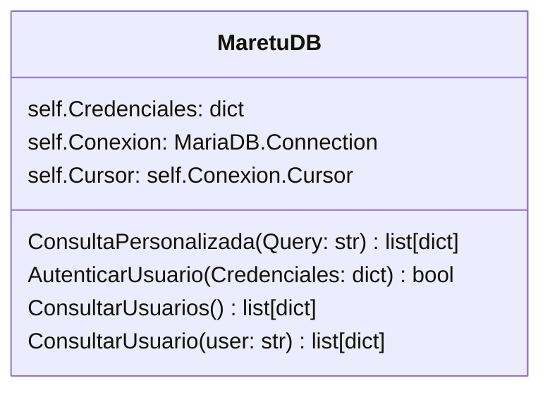
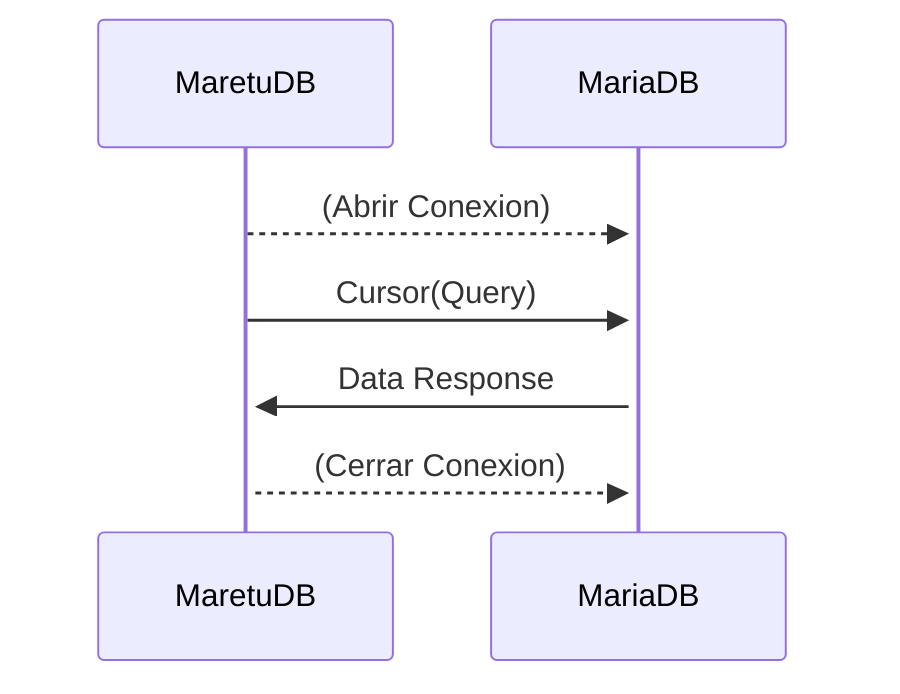

# Módulo: MaretuDB

Módulo diseñado únicamente para la ejecución de consultas SQL a la base de datos correspondiente mediante una clase en python.

> La clase es propensa a actualizarse con más funciones.

Esta clase permite obtener de forma directa consultas SQL específicas a la base de datos, se implementó el uso de POO para facilitar su manejo en el hilo principal de ejecución.

Por defecto, en el código mismo se debe proporcionar las credenciales para el acceso a la base de datos. Otra opción es usar .env pero esto afectará al momento de compilar la aplicación para producción.

## Secuencia de Ejecución

