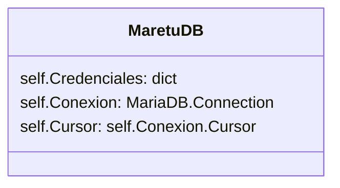
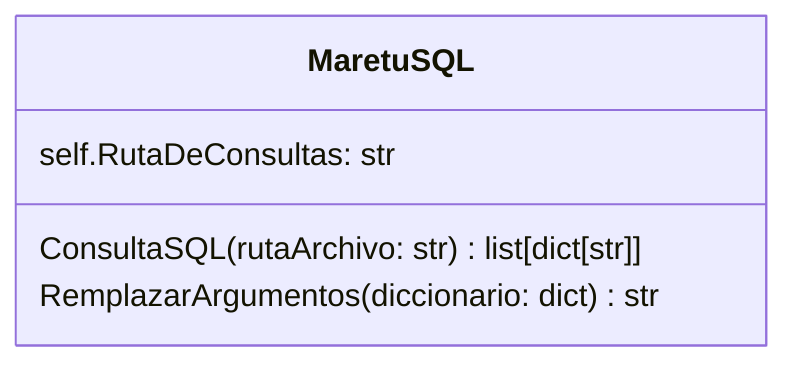
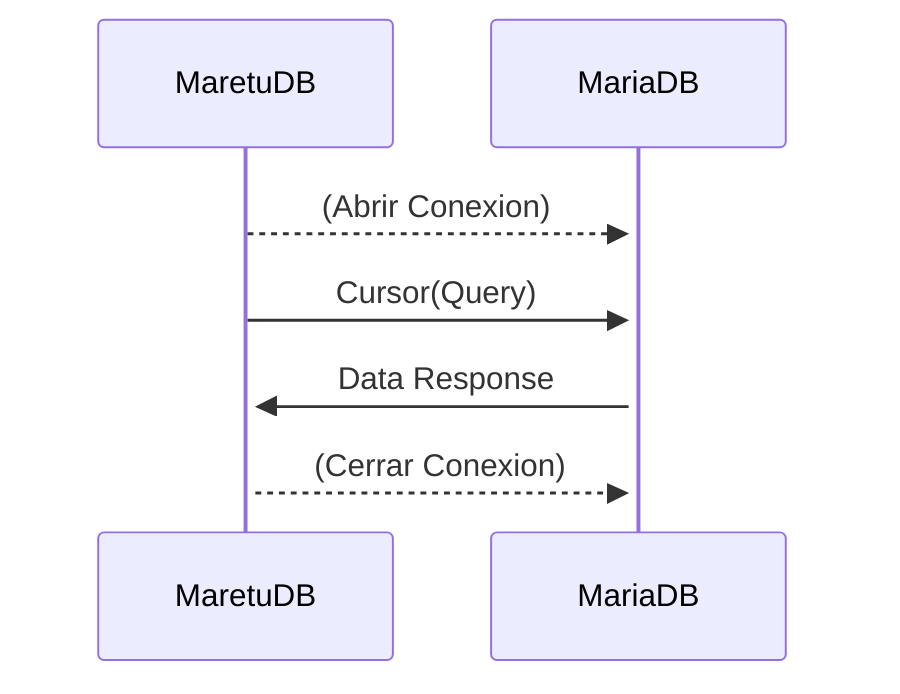

# Módulo: MaretuDB

Módulo diseñado únicamente para la ejecución de consultas SQL a la base de datos correspondiente mediante una clase en python.

### MaretuDB (Clase)

Esta clase está diseñada únicamente para conectarse y realizar consultas a la base de datos, sus funciones pueden ir aumentando progresivamente

En el periodo de desarrollo en el que se escribió este README, el hilo principal mediante la clase MaretuSQL realizan la consulta manualmente sin recurrir a funciones de la clase, usando únicamente el Cursor de la instancia de MariaDB

### MaretuSQL (Clase)

Esta clase está diseñada únicamente para leer archivos de consultas predefinidas por el desarrollador para cada caso de uso. En los archivos de consultas con extension `.sql` en la carpeta `Maretu Server/querys` tienen como "parámetro" sustituible etiquetas similares a las de HTML dependiendo del caso, por ejemplo `<usuario>`.

## Secuencia de Ejecución

