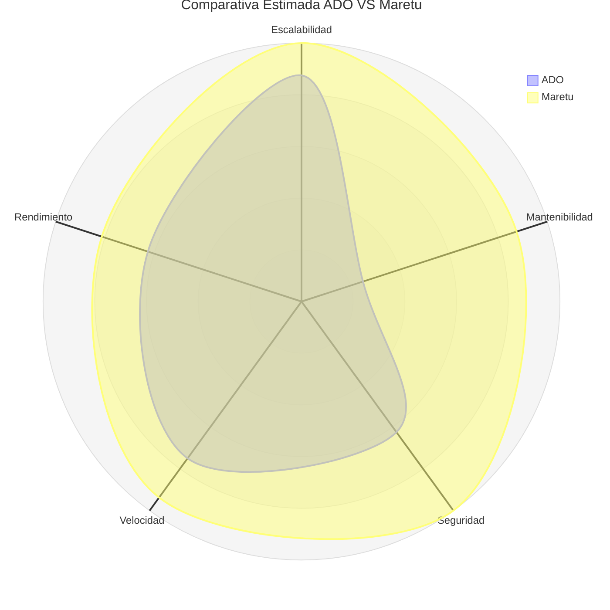

## ¿Qué es "Skell's Maretu"?

> ¡Trabaja cómodo, trabaja fácil, trabaja mejor con Maretu!

"Skell's Maretu" es la "evolución" del concepto de "Skell's ADO", priorizando el rendimiento y la seguridad para maxificar la productividad y control.

## ¿Para qué es Maretu?

Skell's Maretu es un software E.R.P. (Enterprise Resources Planning), es decir, un software de gestión empresarial, abarcando manejo de clientes, inventario y ventas, además de funciones C.R.M. integradas.

## ¿Por qué "Skell's Maretu"?

Skell's Maretu es el sucesor directo de Skell's ADO; el desarrollo de ADO en Streamlit era limitado, inmantenible y sobre todo, poco portable, además de que dependía de un hosting que dependiendo de la configuración del servidor, podría cambiar o dejar de funcionar, mientras que con Maretu se pretende que sean aplicaciones instaladas de forma local en el dispositivo y que esta acceda a la base de datos, siendo unicamente la conexión a la misma la que requiera internet.

Aunque también se planea la posibilidad de hacer una versión dedicada para uso individual con SQLite3, la portabilidad que ofrece Flet es superior a Streamlit por diversos aspectos, permitiendo desarrollar aplicaciones nativas de escritorio e inclusive aplicaciones Android, permitiendo un mayor acceso y distribución al software.

## ¿Por qué cambiamos Streamlit y DJango por Flet?

La respuesta es simple, comodidad pero sobre todo, control. Al desarrollar en Streamlit o DJango había que estar sujetos a cómo trabajaban dichas librerías y a su filosofía de diseño, mientras que con Flet tenemos control sobre casi todo, incluso en el diseño y Querys a la base.

Otro factor importante fue la gestión propia del BackEnd, tanto Streamlit y DJango operaban autonomamente su BackEnd, así que para poder manejarlo mejor y de forma más apropiada se decidio trabajar de forma separada el Servidor.

