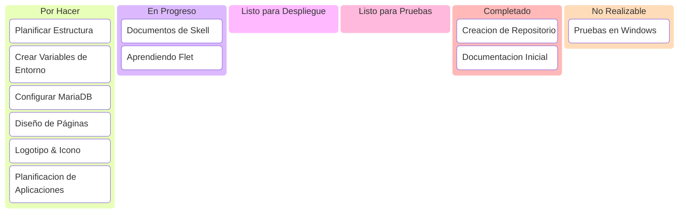

# Lista de Tareas de Skellent

```mermaid
---
config:
  kanban:
    ticketBaseUrl: 'https://github.com/mermaid-js/mermaid/issues/#TICKET#'
---
kanban
  [Por Hacer]
    [Planificar Estructura]
    [Crear Variables de Entorno]
    [Configurar MariaDB]
    [Diseño de Páginas]
    [Logotipo & Icono]
    [Planificacion de Aplicaciones]
  [En Progreso]
    [Documentos de Skell]
    [Aprendiendo Flet]
  [Listo para Despliegue]
  [Listo para Pruebas]
  [Completado]
    [Creacion de Repositorio]
    [Documentacion Inicial]
  [No Realizable]
    [Pruebas en Windows]
```
