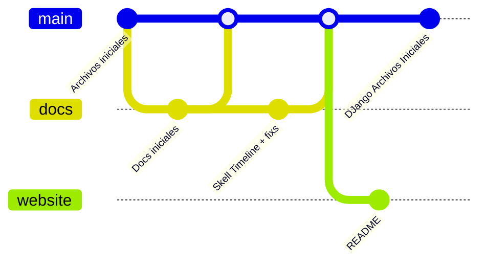
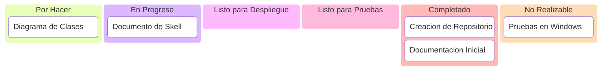
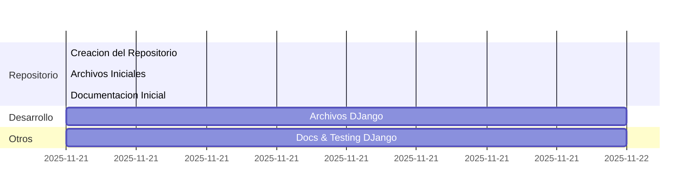

# Repositorio Local de Skellent

```mermaid
gitGraph 
    commit id: "Archivos iniciales"
    branch docs
    switch docs
    commit id: "Docs iniciales"
    switch main
   merge docs
   switch docs
   commit id: "Skell Timeline + fixs"
   switch main
   merge docs
   branch website
   switch website
   commit id: "README"
   switch main
   commit id: "DJango Archivos Iniciales"
```

# Lista de Tareas de Skellent

```mermaid
---
config:
  kanban:
    ticketBaseUrl: 'https://github.com/mermaid-js/mermaid/issues/#TICKET#'
---
kanban
  [Por Hacer]
    [Diagrama de Clases]
  [En Progreso]
    [Documento de Skell]
  [Listo para Despliegue]
  [Listo para Pruebas]
  [Completado]
    [Creacion de Repositorio]
    [Documentacion Inicial]
  [No Realizable]
    [Pruebas en Windows]

```

# Linea de Tiempo de Skellent

```mermaid
gantt
    dateFormat  YYYY-MM-DD
    section Repositorio
    Creacion del Repositorio : a1, 2025-11-21, 0d
    Archivos Iniciales       : after a1, 2025-11-21, 0d
    Documentacion Inicial    : 2025-11-21, 0d
    section Desarrollo
    Archivos DJango          : b1, 2025-11-21, 1d
    section Otros
    Docs & Testing DJango    : after b1, 2025-11-21, 1d
```
